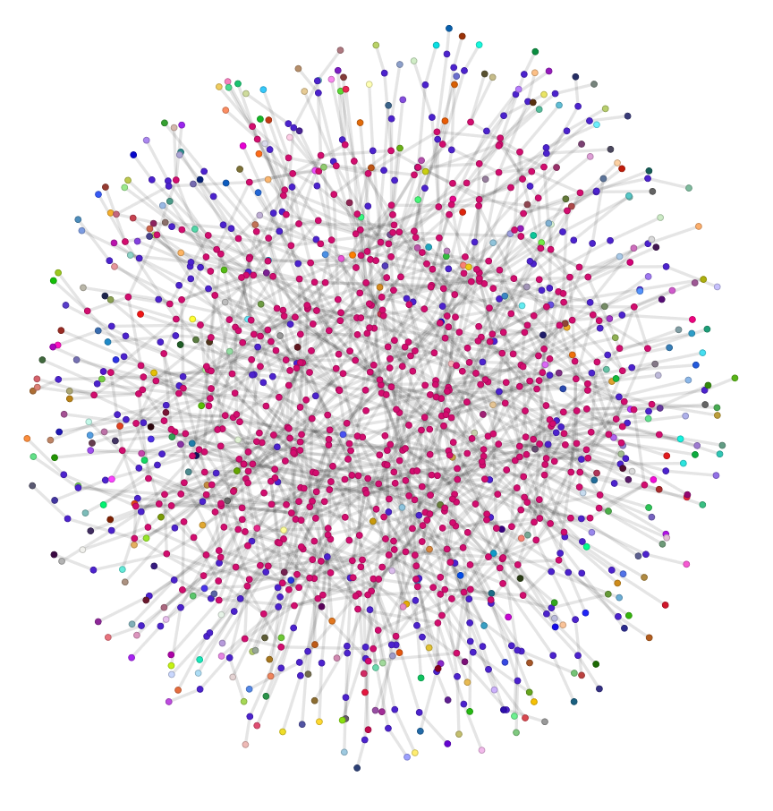

Introduction
============

Jet is an open-source tensor network contraction engine which aims to support
the following workflows:

* Simulate discrete and continuous-variable quantum circuits.

* Estimate the memory and computational requirements of a simulation.

* Contract tensor networks with customizable precision and GPU acceleration.

Follow the `development guide <../dev/guide.html>`_ to get Jet up and running
and then have a look at the quickstart tutorials to see what you can do with Jet.

Quickstart guides
-----------------

The following sections outline the key features of Jet:

1. :doc:`tensors` offers a gentle introduction to tensors and how they are
   modeled in Jet.  Learn about tensor notation and contractions here.

..

2. :doc:`tensor_networks` provides an overview of tensor networks and how Jet
   leverages task-based parallelism to contract tensor networks concurrently.

..

3. :doc:`tensor_network_files` shows how to serialize and deserialize tensor
   networks.  This section details how to use the Jet serializer and presents
   a formal specification of the tensor network file format.
