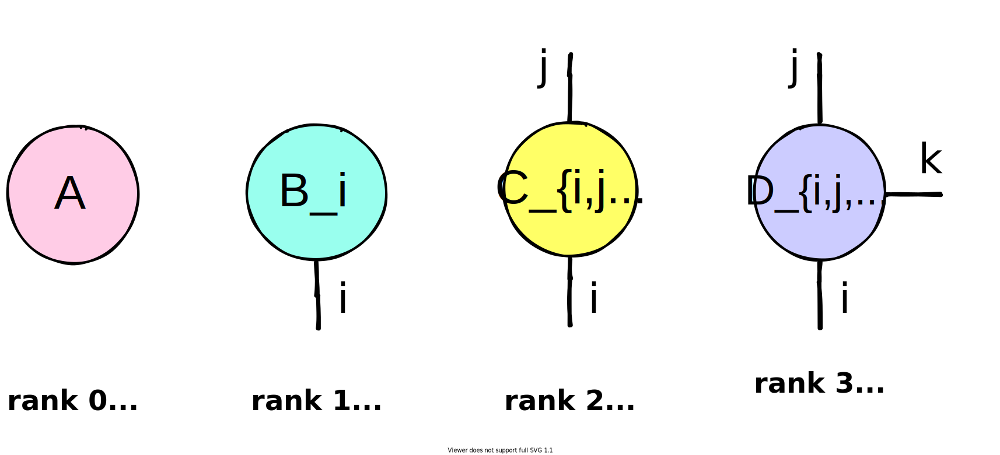
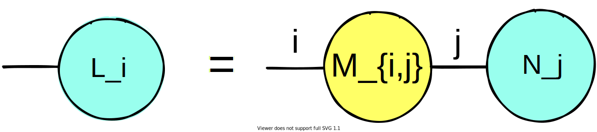
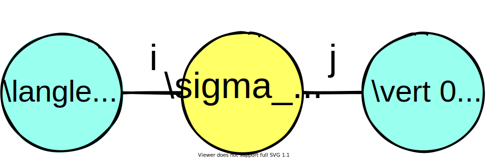

Tensors
=======

.. |br| raw:: html

    

**Tensors** can be described as multi-dimensional arrays, where the dimension is called the *rank*. A tensor of rank 0 is a scalar, a tensor of rank 1 is a vector and a tensor of rank 2 is a matrix, but in general tensors can have arbitrary rank. Visually, tensors are usually represented as circles with legs:

|br|

.. note::

    Refer to the `installation instructions <installing.html>`_ for help with building the examples.

|br|

In Jet we can create these four different tensors easily in a simple C++ or Python program:

.. tabs::

    .. code-tab:: c++

        #include <complex>

        #include <Jet.hpp>

        int main()
        {
            using Tensor = Jet::Tensor<std::complex<float>>;

            Tensor A;                             // Scalar
            Tensor B({"i"}, {2});                 // Vector with index (i) and size 2
            Tensor C({"i", "j"}, {4, 3});         // Matrix with indices (i,j) and size 4x3
            Tensor D({"i", "j", "k"}, {3, 2, 4}); // Rank 3 tensor with indices (i,j,k) and size 3x2x4

            // Fill the tensors with random values
            A.FillRandom();
            B.FillRandom();
            C.FillRandom(7); // Seed RNG with value
            D.FillRandom(7); // Seed RNG with same value

            return 0;
        };

    .. code-tab:: py

        import jet

        A = jet.Tensor()                           # Scalar
        B = jet.Tensor(["i"], [2])                 # Vector with index (i) and size 2
        C = jet.Tensor(["i", "j"], [4, 3])         # Matrix with indices (i,j) and size 4x3
        D = jet.Tensor(["i", "j", "k"], [3, 2, 4]) # Rank 3 tensor with indices (i,j,k) and size 3x2x4

        # Fill the tensors with random values
        A.fill_random()
        B.fill_random()
        C.fill_random(7) # Seed RNG with value
        D.fill_random(7) # Seed RNG with same value

For any given tensor, each leg corresponds to an index variable (:math:`i, j, k,` etc). The power of the tensor representation comes from the intuitive way it expresses problems. Let us take a rank 2 tensor (i.e., a matrix) of size 2x2 as an example.

|br|

.. math::

    M_{i,j}=\begin{bmatrix}
        m_{0,0} & m_{0,1} \\
        m_{1,0} & m_{1,1} \\
    \end{bmatrix}

|br|

Here, we can showcase the various constructors offered by the ``Tensor`` class, allowing you to choose whichever best suits your needs.

.. tabs::

    .. code-tab:: c++

        // Create a tensor with single datum of complex<float>{0.0, 0.0}.
        Tensor M0;

        // Create a 3x2 tensor with automatically-labeled indices and zero-initialized data.
        Tensor M1({3, 2});

        // Create a 2x3x2 tensor with labeled indices (i,j,k) and zero-initialized data.
        Tensor M2({"i", "j", "k"}, {2, 3, 2});

        // Create a copy of the M2 tensor.
        Tensor M3(M2);

        // Create a 2x2 tensor with labeled indices (i,j) and data provided in row-major encoding.
        Tensor M4({"i", "j"}, {2, 2}, {{0, 0}, {1, 0}, {0, 1}, {1, 1}});

    .. code-tab:: py

        # Create a tensor with single datum of 0j.
        M0 = jet.Tensor()

        # Create a 3x2 tensor with automatically-labeled indices and zero-initialized data.
        M1 = jet.Tensor(shape=[3, 2])

        # Create a 2x3x2 tensor with labeled indices (i,j,k) and zero-initialized data.
        M2 = jet.Tensor(indices=["i", "j", "k"], shape=[2, 3, 2])

        # Create a copy of the M2 tensor.
        M3 = jet.Tensor(M2)

        # Create a 2x2 tensor with labeled indices (i,j) and data provided in row-major encoding.
        M4 = jet.Tensor(indices=["i", "j"], shape=[2, 2], data=[0, 1, 1j, 1 + 1j]);

|br|

Let us now generate a few familiar rank 2 tensors, the Pauli operators, using the ``Tensor`` class.

.. tabs::

    .. code-tab:: c++

        std::vector<size_t> size{2, 2};
        std::vector<std::string> indices{"i", "j"};

        std::vector<std::complex<float>> pauli_x_data{{0, 0}, {1, 0}, {1, 0}, {0, 0}};
        std::vector<std::complex<float>> pauli_y_data{{0, 0}, {0, -1}, {0, 1}, {0, 0}};
        std::vector<std::complex<float>> pauli_z_data{{1, 0}, {0, 0}, {0, 0}, {-1, 0}};

        Tensor X(indices, size, pauli_x_data);
        Tensor Y(indices, size, pauli_y_data);
        Tensor Z(indices, size, pauli_z_data);

    .. code-tab:: py

        size = [2, 2]
        indices = ["i", "j"]

        pauli_x_data = [0, 1, 1, 0]
        pauli_y_data = [0, -1j, 1j, 0]
        pauli_z_data = [1, 0, 0, -1]

        X = jet.Tensor(indices, size, pauli_x_data);
        Y = jet.Tensor(indices, size, pauli_y_data);
        Z = jet.Tensor(indices, size, pauli_z_data);

The two indices :math:`i,j`, allow us to label the axes of the matrices. This notation easily allows operations like matrix-vector and matrix-matrix products to generalize for arbitrary dimensions. As an example, a matrix-vector product, described by notation:

.. math::

    L=\displaystyle\sum\limits_{j} M_{i,j} N_j =\begin{bmatrix}
        m_{0,0} & m_{0,1} \\
        m_{1,0} & m_{1,1} \\
    \end{bmatrix}
    \begin{bmatrix}
    n_0 \\
    n_1
    \end{bmatrix}=
    \begin{bmatrix}
        m_{0,0}n_0 + m_{0,1}n_1 \\
        m_{1,0}n_0 + m_{1,1}n_1 \\
    \end{bmatrix}

|br|

can be expressed in graphical notation as:

|br|

|br|

The above demonstrates a unique property of tensors: by connecting legs with shared indices, we can perform Einstein summation over the shared indices. After this index *contraction*, the resulting tensor is formed with indices that did not participate in the operation. For the above example, over a shared index :math:`j`, the tensors :math:`M_{i,j}` and :math:`N_j` form a new rank 1 tensor, :math:`L_i`.

|br|

Taking our Pauli operators from earlier, we can use this tensor representation to describe operations on quantum states, just as one would with a quantum circuit. 
Expanding on the above, we now aim to calculate an expectation value of Pauli-Z operator, :math:`\langle 0 \vert \sigma_z \vert 0 \rangle`, defined as: 

.. math::
    \langle 0 \vert \sigma_z \vert 0 \rangle=\begin{bmatrix}
        1 & 0
    \end{bmatrix}\begin{bmatrix}
        1 & 0 \\
        0 & -1 \\
    \end{bmatrix}\begin{bmatrix}
        1 \\
        0
    \end{bmatrix}

|br|

which can be represented in graphical notation as:

|br|

Since we already know the result of this calculation (:math:`1.0`), we can easily compare with Jet, as

.. tabs::

    .. code-tab:: c++

        Tensor bra({"i"}, {2}, {{1, 0}, {0, 0}});
        Tensor ket = bra; // Transposes are handled internally

        Tensor op_ket = Z.ContractWithTensor(ket);
        Tensor bra_op_ket = bra.ContractWithTensor(op_ket);

        std::cout << "<0|sigma_z|0> = " << bra_op_ket.GetScalar() << std::endl;

    .. code-tab:: py

        bra = jet.Tensor(indices=["i"], shape=[2], data=[1, 0])
        ket = jet.Tensor(bra)  # Transposes are handled internally

        op_ket = Z.contract_with_tensor(ket);
        bra_op_ket = bra.contract_with_tensor(op_ket);

        print("<0|sigma_z|0> =", bra_op_ket.scalar)

which outputs 

.. tabs::

    .. code-tab:: text C++

        <0|sigma_z|0> = (1,0)

    .. code-tab:: text Python

        <0|sigma_z|0> = (1+0j)

as expected.

|br|

We can see that tensors, though useful individually, provide an incredibly powerful representation for performing calculations when combined together. We can next extend the above ideas to `Tensor Networks <tensor_networks.html>`_.
